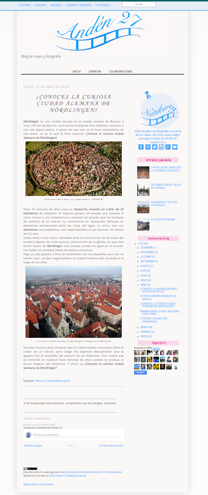

## Introducción
La inmensa mayoría de blogs siguen una estructura similar: 
- una cabecera, 
- un área para el contenido, 
- uno o varios elementos de navegación, 
- un área de contenido accesorio y un pie. 

Esta estructura en HTML5 se representaría con los elementos: 
- `<header>` (cabecera), 
- `<main>` (para el contenido principal), 
- `<nav>` (para la navegación), 
- `<aside>` (para el contenido accesorio) y 
- `<footer>` (para el pie). 
Dentro del elemento `<main>` se utilizan etiquetas `<article>` para cada entrada del blog.

La estructura correspondería al [esquema siguiente](https://webdesign.tutsplus.com/html-5-and-css-3-the-techniques-youll-soon-be-using--net-5708t)

Teniendo esto en cuenta, vamos a clonar la estructura del siguiente blog:
[Anden27](http://anden-27.blogspot.com/)

## Objetivo
Clonar la siguiente página del blog Anden 27:

gif animado

 

captura de pantalla

 

## Recursos
- las imágenes necesarias para clonar la página las encontrarás en la carpeta `assets`
- el texto de la página lo tienes en el fichero `index.html`.
- En el documento [Anden-27.pdf](./Anden-27.pdf) tenéis la descripción de los estilos que se han de aplicar a cada parte del documento.

## Backlog 
- La página tiene una barra de navegación principal que está fija en la parte superior de la página y ocupa todo el ancho de la pantalla.
- Esta barra de navegación contiene un formulario para realizar búsquedas en el sitio web.
- La página tiene un encabezado con una imagen del logo del sitio y un subtítulo.
- Existe  una barra de navegación secundaria con enlaces a otras páginas.
- El artículo consta de la fecha, título del artículo, texto y dos fotografías con pie de foto.
- En el texto del artículo deben aparecer resaltadas algunas partes del texto.
- En el artículo debe aparecer un formulario para poder realizar comentarios.
- Debe aparecer una barra lateral con:
  - fotografía de enlace a redes sociales.
  - Una sección de entradas populares con enlaces a otros artículos destacados.
  - Una sección de archivo del blog con enlace a entradas antiguas del blog.
  - Debe aparecer una sección de seguidores
- Debe aparecer un pie de página con enlace a información de licencias.
- Debe aparecer un icono fijado para navegar al inicio de la página.
 
## Requirements 

- Utiliza una hoja de estilos aparte que se denomine `style.css` para incluir lo estilos.
- El proyecto se debe desplegar en una github-page.

## Spikes
- Pair-programming
- CSS
  - Selectores
  - Especificidad
  - Herencia
  - Color
  - Unidades de medida
  - Imágenes
  - Fondos
  - Modelo de Caja: bordes, márgenes y padding
  - Seudoelementos
  - Seudoclases
  - Sombras
  - Texto y tipografía
  - Posicionamiento
  - Buenas prácticas

## Desarrollo
- Este trabajo se realizará en pair-programming. Respeta los turnos y los roles de Driver y Navigator.
- Sigue buenas prácticas de maquetación:
  - Comienza desde los elementos exteriores a los interiores.
  - Primero posiciona, dimensiona y, por último, aplica estilos que no variarán la posición de los elementos.
  - La hoja de estilos debe comenzar a completarse desde los estilos más generales a los más específicos. Siguiendo el flujo normal de la página.

### Iteración 1: Preparación del proyecto
- Creamos la carpeta que va a contener el proyecto en nuestra máquina local.
- Añadimos git a nuestro proyecto local.
- Añadimos el repositorio remoto a nuestro proyecto local.
- Crea la hoja de estilos y conéctala al html.
- Añade los estilos de reset.
- Haz commit con el resultado.

### Iteración 2: HTML
- Recuadra las secciones para conocer las cajas contenedoras.
- Crea las etiquetas semánticas de las cajas contenedoras. Recuerda que la etiqueta `
`sólo debe utilizarse para aplicar estilos.
- Asigna etiquetas al resto del contenido.
- Haz commit con el resultado.

### Iteración 3: Layout
- Dimensiona y posiciona las cajas contenedoras.
- Continúa con el resto de divisiones dentro de las cajas, aplica dimensiones y posicionamiento.
- Haz commit del resultado.

### Iteración 4: Detalles
- Comenzando por la caja superior, ve aplicando estilos a los elementos que contienen las cajas.

### Iteración 5: despliegue del proyecto
- Creamos una github page desde el repositorio del proyecto.
- Actualizamos el readme del proyecto con la url de gh page.

## Entrega
- Se hará una presentación del proyecto.
- Se compartirá la url del repositorio de github y de la gh page.

## Evaluación
- [ ] La página es exactamente igual a la muestra.
- [ ] Las etiquetas html están bien elegidas para el cometido que se utilizan.
- [ ] El html es semántico y accesible (en la medida de lo posible).
- [ ] La página de estilos está limpia y ordenada. Las reglas y las propiedades siguen un patrón.
- [ ] Se han aplicado los principios YAGNI y DRY.
- [ ] Se ha incluido un fichero de readme en el proyecto con información sobre el mismo.
- [ ] Se ha incluido un link a la presentación desde el readme del proyecto.
- [ ] Todos los miembros del equipo se han sentido escuchados.
- [ ] Todos los miembros del equipo han colaborado en el resultado final.
- [ ] Has encontrado otros recursos que te han sido útiles a la hora de desarrollar el proyecto.
- [ ] Has introducido grid o flex en el proyecto.
- [ ] La página es responsive.

## Recursos

Validador CSS: https://validator.w3.org/
Curso CSS:
- Google: https://web.dev/learn/css?hl=es
- w3Schools: https://www.w3schools.com/css/
- Estructura con CSS: https://es.learnlayout.com/no-layout

